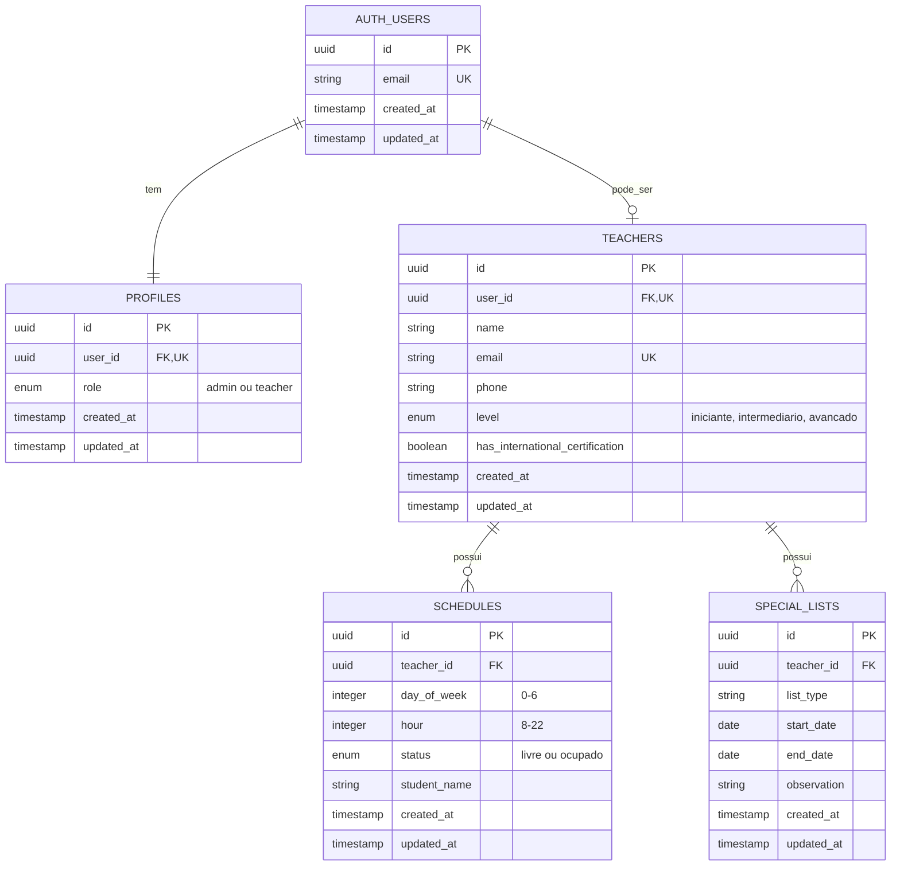
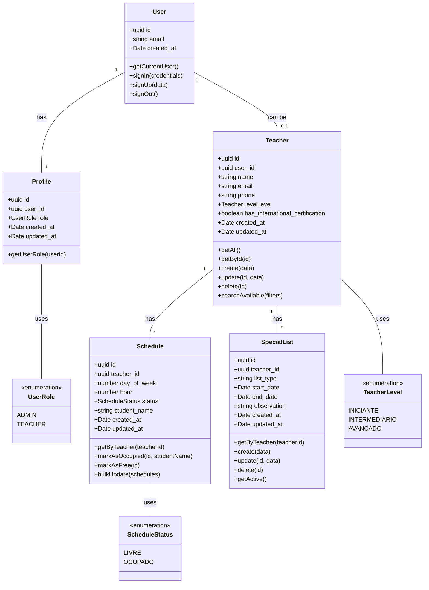

# 📊 Diagrama de Entidades e Relacionamentos (ER)

## Modelo Conceitual



---

## Relacionamentos Detalhados

### 1. AUTH_USERS ↔ PROFILES (1:1)
- **Cardinalidade:** Um para Um (obrigatório)
- **Descrição:** Todo usuário autenticado DEVE ter exatamente um perfil
- **Chave Estrangeira:** `profiles.user_id` → `auth.users.id`
- **Restrições:**
  - `user_id` é UNIQUE
  - Criado automaticamente via trigger ao criar usuário
  - DELETE CASCADE ao remover usuário

### 2. AUTH_USERS ↔ TEACHERS (1:0..1)
- **Cardinalidade:** Um para Zero ou Um (opcional)
- **Descrição:** Um usuário PODE ser um professor (se role='teacher')
- **Chave Estrangeira:** `teachers.user_id` → `auth.users.id`
- **Restrições:**
  - `user_id` é UNIQUE
  - Apenas criado se `profiles.role = 'teacher'`
  - DELETE CASCADE ao remover usuário

### 3. TEACHERS ↔ SCHEDULES (1:N)
- **Cardinalidade:** Um para Muitos
- **Descrição:** Um professor possui múltiplos horários na agenda
- **Chave Estrangeira:** `schedules.teacher_id` → `teachers.id`
- **Restrições:**
  - Um professor pode ter múltiplos horários
  - Cada horário pertence a apenas um professor
  - UNIQUE(teacher_id, day_of_week, hour) - não pode duplicar horário
  - DELETE CASCADE ao remover professor

### 4. TEACHERS ↔ SPECIAL_LISTS (1:N)
- **Cardinalidade:** Um para Muitos
- **Descrição:** Um professor pode estar em múltiplas listas especiais
- **Chave Estrangeira:** `special_lists.teacher_id` → `teachers.id`
- **Restrições:**
  - Um professor pode ter múltiplas listas
  - Cada lista pertence a apenas um professor
  - DELETE CASCADE ao remover professor

---

## Diagrama de Classes (TypeScript)



---

## Interfaces TypeScript

```typescript
// ============= ENUMS =============

export enum UserRole {
  ADMIN = 'admin',
  TEACHER = 'teacher'
}

export enum TeacherLevel {
  INICIANTE = 'iniciante',
  INTERMEDIARIO = 'intermediario',
  AVANCADO = 'avancado'
}

export enum ScheduleStatus {
  LIVRE = 'livre',
  OCUPADO = 'ocupado'
}

export enum ListType {
  FERIAS = 'ferias',
  LICENCA_MEDICA = 'licenca_medica',
  AFASTAMENTO = 'afastamento',
  OUTRO = 'outro'
}

// ============= ENTIDADES =============

export interface User {
  id: string;
  email: string;
  created_at: Date;
  updated_at: Date;
}

export interface Profile {
  id: string;
  user_id: string;
  role: UserRole;
  created_at: Date;
  updated_at: Date;
}

export interface Teacher {
  id: string;
  user_id: string;
  name: string;
  email: string;
  phone?: string;
  level: TeacherLevel;
  has_international_certification: boolean;
  created_at: Date;
  updated_at: Date;
}

export interface Schedule {
  id: string;
  teacher_id: string;
  day_of_week: number; // 0 (Domingo) - 6 (Sábado)
  hour: number; // 8 - 22
  status: ScheduleStatus;
  student_name?: string;
  created_at: Date;
  updated_at: Date;
}

export interface SpecialList {
  id: string;
  teacher_id: string;
  list_type: ListType | string;
  start_date?: Date;
  end_date?: Date;
  observation?: string;
  created_at: Date;
  updated_at: Date;
}

// ============= DTOs =============

export interface CreateTeacherDTO {
  user_id: string;
  name: string;
  email: string;
  phone?: string;
  level: TeacherLevel;
  has_international_certification: boolean;
}

export interface UpdateTeacherDTO {
  name?: string;
  phone?: string;
  level?: TeacherLevel;
  has_international_certification?: boolean;
}

export interface CreateScheduleDTO {
  teacher_id: string;
  day_of_week: number;
  hour: number;
  status?: ScheduleStatus;
  student_name?: string;
}

export interface UpdateScheduleDTO {
  status?: ScheduleStatus;
  student_name?: string;
}

export interface CreateSpecialListDTO {
  teacher_id: string;
  list_type: ListType | string;
  start_date?: Date;
  end_date?: Date;
  observation?: string;
}

export interface UpdateSpecialListDTO {
  list_type?: ListType | string;
  start_date?: Date;
  end_date?: Date;
  observation?: string;
}

// ============= FILTROS =============

export interface SearchTeachersFilters {
  day_of_week?: number;
  hour?: number;
  level?: TeacherLevel;
  has_international_certification?: boolean;
}

export interface ScheduleFilters {
  teacher_id?: string;
  day_of_week?: number;
  status?: ScheduleStatus;
}

export interface SpecialListFilters {
  teacher_id?: string;
  list_type?: ListType | string;
  active_only?: boolean; // Filtra listas ativas (entre start_date e end_date)
}

// ============= VIEWS/RESPONSES =============

export interface TeacherWithSchedules extends Teacher {
  schedules: Schedule[];
}

export interface TeacherWithLists extends Teacher {
  special_lists: SpecialList[];
}

export interface ScheduleGridItem {
  day_of_week: number;
  hour: number;
  status: ScheduleStatus;
  student_name?: string;
  schedule_id?: string;
}

export interface TeacherSearchResult extends Teacher {
  available_hours: number;
  matching_schedules: Schedule[];
}
```

---

## Regras de Negócio

### Validações de Agenda (Schedule)

1. **Unicidade de Horário**
   ```sql
   UNIQUE(teacher_id, day_of_week, hour)
   ```
   - Um professor não pode ter dois registros para o mesmo dia/hora

2. **Horários Permitidos**
   - `day_of_week`: 0-6 (Domingo a Sábado)
   - `hour`: 8-22 (8h às 22h)

3. **Nome do Aluno**
   - Obrigatório quando `status = 'ocupado'`
   - NULL quando `status = 'livre'`

4. **Status Padrão**
   - Novos horários criados com `status = 'livre'`

### Validações de Professor (Teacher)

1. **Email Único**
   ```sql
   UNIQUE(email)
   ```
   - Não pode haver dois professores com mesmo email

2. **Níveis Válidos**
   - iniciante
   - intermediario
   - avancado

3. **Certificação**
   - Valor booleano (true/false)
   - Padrão: false

### Validações de Lista Especial (SpecialList)

1. **Datas**
   - `end_date` deve ser >= `start_date` (se ambos fornecidos)
   - Datas são opcionais

2. **Tipos Comuns**
   - ferias
   - licenca_medica
   - afastamento
   - outro (para casos especiais)

3. **Sobreposição**
   - Permitido ter múltiplas listas ativas simultaneamente
   - Cada lista é independente

---

## Índices Sugeridos

Para otimizar performance:

```sql
-- PROFILES
CREATE INDEX idx_profiles_user_id ON profiles(user_id);
CREATE INDEX idx_profiles_role ON profiles(role);

-- TEACHERS
CREATE INDEX idx_teachers_user_id ON teachers(user_id);
CREATE INDEX idx_teachers_email ON teachers(email);
CREATE INDEX idx_teachers_level ON teachers(level);
CREATE INDEX idx_teachers_certification ON teachers(has_international_certification);

-- SCHEDULES
CREATE INDEX idx_schedules_teacher_id ON schedules(teacher_id);
CREATE INDEX idx_schedules_status ON schedules(status);
CREATE INDEX idx_schedules_day_hour ON schedules(day_of_week, hour);
CREATE UNIQUE INDEX idx_schedules_unique_slot ON schedules(teacher_id, day_of_week, hour);

-- SPECIAL_LISTS
CREATE INDEX idx_special_lists_teacher_id ON special_lists(teacher_id);
CREATE INDEX idx_special_lists_type ON special_lists(list_type);
CREATE INDEX idx_special_lists_dates ON special_lists(start_date, end_date);
```

---

## Triggers Necessários

### 1. Criar Profile Automaticamente
```sql
CREATE OR REPLACE FUNCTION public.handle_new_user()
RETURNS TRIGGER AS $$
BEGIN
  INSERT INTO public.profiles (user_id, role)
  VALUES (NEW.id, 'teacher'); -- role padrão
  RETURN NEW;
END;
$$ LANGUAGE plpgsql SECURITY DEFINER;

CREATE TRIGGER on_auth_user_created
  AFTER INSERT ON auth.users
  FOR EACH ROW EXECUTE FUNCTION public.handle_new_user();
```

### 2. Atualizar updated_at Automaticamente
```sql
CREATE OR REPLACE FUNCTION update_updated_at_column()
RETURNS TRIGGER AS $$
BEGIN
  NEW.updated_at = NOW();
  RETURN NEW;
END;
$$ LANGUAGE plpgsql;

-- Aplicar a todas as tabelas
CREATE TRIGGER update_profiles_updated_at BEFORE UPDATE ON profiles
  FOR EACH ROW EXECUTE FUNCTION update_updated_at_column();

CREATE TRIGGER update_teachers_updated_at BEFORE UPDATE ON teachers
  FOR EACH ROW EXECUTE FUNCTION update_updated_at_column();

CREATE TRIGGER update_schedules_updated_at BEFORE UPDATE ON schedules
  FOR EACH ROW EXECUTE FUNCTION update_updated_at_column();

CREATE TRIGGER update_special_lists_updated_at BEFORE UPDATE ON special_lists
  FOR EACH ROW EXECUTE FUNCTION update_updated_at_column();
```

---

**Última atualização:** 02/11/2025
