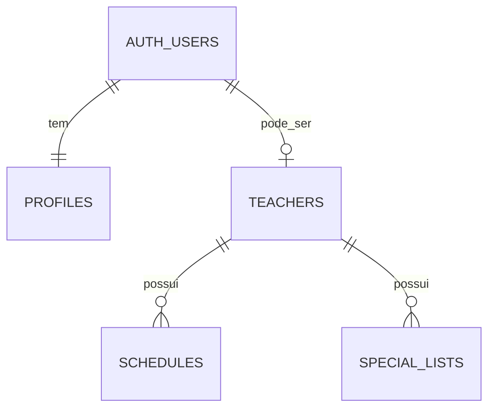
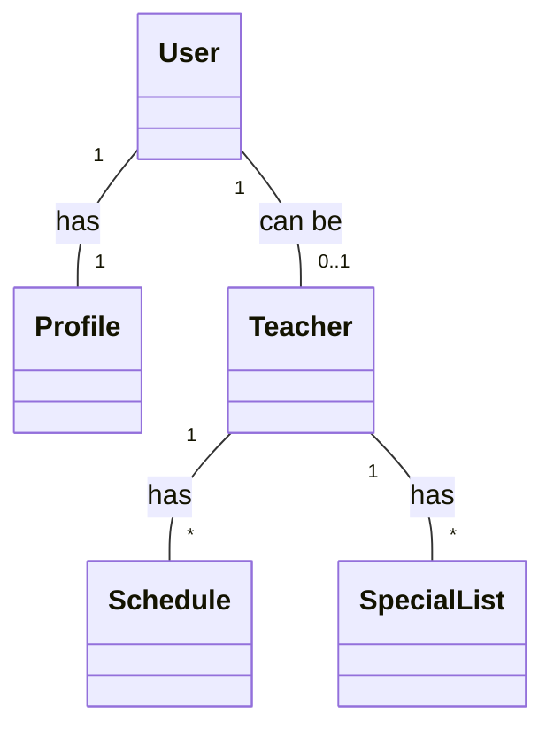

# 📋 Resumo da Documentação Gerada

## ✅ Documentos Criados

Toda a documentação necessária para o projeto **AgendaPro** foi criada com sucesso!

### 1. 📖 README.md (Raiz do Projeto)
**Localização:** `/README.md`

Atualizado com:
- Visão geral do projeto
- Status atual (30% completo)
- Quick start guide
- Tecnologias utilizadas
- Scripts disponíveis
- Estrutura do projeto
- Como contribuir
- Changelog

### 2. 📚 docs/README.md (Índice da Documentação)
**Localização:** `/docs/README.md`

Hub central da documentação com:
- Índice de todos os documentos
- Navegação rápida por funcionalidade
- Status do projeto
- Tecnologias
- Como contribuir
- Changelog

### 3. 📋 docs/PROJECT_DOCUMENTATION.md
**Localização:** `/docs/PROJECT_DOCUMENTATION.md`

Documentação completa incluindo:
- Visão geral e objetivos
- Tipos de usuário e permissões
- Funcionalidades principais (status de cada uma)
- Modelo de dados detalhado
- Políticas RLS (Row Level Security)
- Arquitetura do sistema
- Fluxos de dados
- Sistema de temas
- Responsividade
- Próximos passos

### 4. 📊 docs/DATA_MODEL.md
**Localização:** `/docs/DATA_MODEL.md`

Modelo de dados com:
- **Diagrama ER (Mermaid)**
  - 5 entidades principais
  - Relacionamentos detalhados
  - Cardinalidades
- **Diagrama de Classes (Mermaid)**
  - Classes TypeScript
  - Enumerações
  - Relacionamentos
- **Interfaces TypeScript completas**
  - Entidades
  - DTOs
  - Filtros
  - Views/Responses
- **Regras de negócio**
- **Índices sugeridos**
- **Triggers necessários**

### 5. ✅ docs/FEATURES_CHECKLIST.md
**Localização:** `/docs/FEATURES_CHECKLIST.md`

Checklist detalhado com:
- Status de 11 categorias de features
- ✅ Implementado / ⚠️ Parcial / ❌ Não Implementado
- Próximos passos para cada categoria
- Prioridades (Alta/Média/Baixa)
- Resumo de status geral
- Queries SQL sugeridas

**Categorias:**
1. Autenticação (70%)
2. Professores (40%)
3. Agenda (10%)
4. Busca (5%)
5. Listas Especiais (5%)
6. Perfil (20%)
7. Interface (60%)
8. Funcionalidades Técnicas (25%)
9. Relatórios (0%)
10. Notificações (0%)
11. Features Futuras

### 6. 🗺️ docs/ROADMAP.md
**Localização:** `/docs/ROADMAP.md`

Roadmap de desenvolvimento com:
- **10 Sprints planejadas** (2 semanas cada)
- Sprint 0: ✅ Completo (Setup inicial)
- Sprint 1: 🔄 Em Progresso (Fundação - 30%)
- Sprints 2-10: 📋 Planejadas
- Objetivos, tasks e critérios de aceite para cada sprint
- Métricas de sucesso
- Marcos importantes
- Backlog futuro (integrações, features avançadas)

**Timeline:**
- MVP Agenda: 29/11/2025
- MVP Busca: 13/12/2025
- MVP Release: 24/01/2026
- Production Ready: 21/03/2026
- V1.0 Launch: 01/04/2026

### 7. 🗄️ supabase/setup.sql
**Localização:** `/supabase/setup.sql`

Script SQL completo com:
- **Triggers**
  - Criar profile automaticamente
  - Atualizar updated_at
- **Políticas RLS** para todas as tabelas
  - profiles
  - teachers
  - schedules
  - special_lists
- **Índices** para otimização
- **Constraints** de validação
- **Funções auxiliares**
  - search_available_teachers()
  - count_free_hours()
  - is_teacher_in_special_list()
- **Views úteis**
- **Seed data** (comentado)

---

## 📊 Diagramas Incluídos

### 1. Diagrama ER (Entity-Relationship)


### 2. Diagrama de Classes


Ambos os diagramas estão no formato Mermaid e renderizam automaticamente no GitHub/VS Code.

---

## 🎯 Status Geral do Projeto

| Categoria | Progresso | Observação |
|-----------|-----------|------------|
| **Documentação** | ✅ 100% | Completa e detalhada |
| **Autenticação** | 🟡 70% | Base sólida, falta recuperação de senha |
| **Professores** | 🟡 40% | Listagem ok, falta CRUD completo |
| **Agenda** | 🔴 10% | Apenas estrutura básica |
| **Busca** | 🔴 5% | Apenas UI criada |
| **Listas Especiais** | 🔴 5% | Apenas UI criada |
| **Interface** | 🟢 60% | Componentes base prontos |
| **Backend/DB** | 🟡 25% | Tabelas ok, falta lógica |
| **TOTAL** | 🟡 **~30%** | **MVP em desenvolvimento** |

---

## 🚀 Próximos Passos Recomendados

### Imediato (Sprint 1 - até 15/11/2025)
1. **Executar script SQL no Supabase**
   - Abra o SQL Editor
   - Execute `/supabase/setup.sql`
   - Verifique se não há erros

2. **Testar políticas RLS**
   - Criar usuários de teste
   - Validar permissões
   - Corrigir se necessário

3. **Implementar recuperação de senha**
   - Usar Supabase Auth
   - Criar fluxo de reset

### Curto Prazo (Sprint 2 - até 29/11/2025)
4. **Implementar ScheduleGrid completo**
   - Grade 7x15 (dias x horas)
   - Interação com horários
   - Visual feedback

5. **CRUD de horários**
   - Marcar/desmarcar
   - Adicionar aluno
   - Operações em lote

### Médio Prazo (Sprint 3 - até 13/12/2025)
6. **Busca de professores**
   - Implementar filtros
   - Query otimizada
   - Exibição de resultados

---

## 📂 Estrutura de Arquivos Criados

```
prof-flow-manager/
├── README.md                    ✅ Atualizado
├── docs/
│   ├── README.md               ✅ Novo
│   ├── PROJECT_DOCUMENTATION.md ✅ Novo
│   ├── DATA_MODEL.md           ✅ Novo
│   ├── FEATURES_CHECKLIST.md   ✅ Novo
│   └── ROADMAP.md              ✅ Novo
└── supabase/
    └── setup.sql               ✅ Novo
```

---

## 💡 Como Usar a Documentação

### Para Desenvolvedores
1. **Antes de começar uma feature:**
   - Leia [FEATURES_CHECKLIST.md](../docs/FEATURES_CHECKLIST.md)
   - Consulte [DATA_MODEL.md](../docs/DATA_MODEL.md)
   - Veja [ROADMAP.md](../docs/ROADMAP.md)

2. **Durante o desenvolvimento:**
   - Siga os padrões em [PROJECT_DOCUMENTATION.md](../docs/PROJECT_DOCUMENTATION.md)
   - Use as interfaces TypeScript do DATA_MODEL

3. **Ao finalizar:**
   - Atualize o checklist
   - Documente decisões técnicas
   - Faça code review

### Para Product Owners/Managers
1. **Planejamento:**
   - Consulte [ROADMAP.md](../docs/ROADMAP.md)
   - Veja prioridades em [FEATURES_CHECKLIST.md](../docs/FEATURES_CHECKLIST.md)

2. **Acompanhamento:**
   - Monitore status geral
   - Verifique marcos importantes
   - Ajuste prioridades

### Para DBAs
1. **Setup inicial:**
   - Execute [supabase/setup.sql](../supabase/setup.sql)
   - Verifique triggers e políticas

2. **Otimização:**
   - Use índices sugeridos
   - Monitore performance
   - Ajuste conforme necessário

---

## 🎉 Resumo

Toda a documentação necessária foi criada com sucesso! O projeto AgendaPro agora tem:

✅ **7 documentos completos**  
✅ **2 diagramas (ER + Classes)**  
✅ **Roadmap de 10 sprints**  
✅ **Script SQL pronto para uso**  
✅ **Checklist de 100+ features**  
✅ **Guias de contribuição**  

**A documentação está pronta para auxiliar todas as decisões de desenvolvimento!** 🚀

---

**Gerado em:** 02/11/2025  
**Versão:** 1.0.0  
**Status:** ✅ Completo
