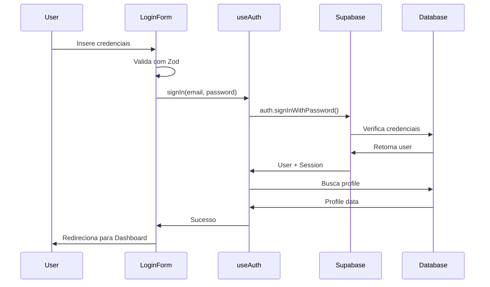

# Feature: Autenticação e Autorização

## Status: ✅ Implementado

**Data de Implementação**: 2025-11-17
**Versão**: 1.0.0
**Responsável**: Sistema

## 📋 Visão Geral

Sistema completo de autenticação e autorização usando Supabase Auth com Context API para gerenciamento de estado global de autenticação.

## 🎯 Objetivos

- ✅ Autenticação segura com email e senha
- ✅ Gestão de sessões persistentes
- ✅ Controle de acesso baseado em roles (Admin/Teacher)
- ✅ Profile management integrado
- ✅ Logout seguro
- ✅ Validação de formulários com Zod

## 🏗️ Arquitetura

### Componentes Principais

```
src/
├── hooks/
│   └── useAuth.tsx           # Context Provider e Hook de autenticação
├── components/
│   └── Auth/
│       └── LoginForm.tsx     # Formulário de login
├── pages/
│   └── Index.tsx             # Roteamento baseado em auth
└── lib/
    └── validators.ts         # Schema de validação Zod
```

### Fluxo de Autenticação



## 💾 Estrutura de Dados

### Tabela: profiles

```sql
CREATE TABLE profiles (
  id UUID PRIMARY KEY REFERENCES auth.users(id),
  email TEXT NOT NULL,
  name TEXT NOT NULL,
  phone TEXT,
  role TEXT NOT NULL CHECK (role IN ('admin', 'teacher', 'student')),
  level TEXT CHECK (level IN ('iniciante', 'intermediario', 'avancado', 'nativo')),
  has_certification BOOLEAN DEFAULT FALSE,
  created_at TIMESTAMPTZ DEFAULT NOW(),
  updated_at TIMESTAMPTZ DEFAULT NOW()
);
```

### RLS Policies

```sql
-- Users podem ler seu próprio perfil
CREATE POLICY "Users can read own profile"
  ON profiles FOR SELECT
  USING (auth.uid() = id);

-- Users podem atualizar seu próprio perfil
CREATE POLICY "Users can update own profile"
  ON profiles FOR UPDATE
  USING (auth.uid() = id);

-- Admins podem ler todos os perfis
CREATE POLICY "Admins can read all profiles"
  ON profiles FOR SELECT
  USING (
    EXISTS (
      SELECT 1 FROM profiles
      WHERE id = auth.uid() AND role = 'admin'
    )
  );
```

## 🔧 Implementação

### 1. Hook useAuth

**Arquivo**: `src/hooks/useAuth.tsx`

```typescript
import { createContext, useContext, useEffect, useState, ReactNode } from 'react';
import { User as SupabaseUser } from '@supabase/supabase-js';
import { supabase } from '@/integrations/supabase/client';
import { Database } from '@/integrations/supabase/types';

type Profile = Database['public']['Tables']['profiles']['Row'];

interface AuthContextType {
  user: SupabaseUser | null;
  profile: Profile | null;
  loading: boolean;
  signIn: (email: string, password: string) => Promise<void>;
  signOut: () => Promise<void>;
  isAdmin: boolean;
  isTeacher: boolean;
}

const AuthContext = createContext<AuthContextType | undefined>(undefined);

export function useAuth() {
  const context = useContext(AuthContext);
  if (!context) {
    throw new Error('useAuth must be used within AuthProvider');
  }
  return context;
}

export function AuthProvider({ children }: { children: ReactNode }) {
  const [user, setUser] = useState<SupabaseUser | null>(null);
  const [profile, setProfile] = useState<Profile | null>(null);
  const [loading, setLoading] = useState(true);

  useEffect(() => {
    // Check active session
    supabase.auth.getSession().then(({ data: { session } }) => {
      setUser(session?.user ?? null);
      if (session?.user) {
        fetchProfile(session.user.id);
      } else {
        setLoading(false);
      }
    });

    // Listen for auth changes
    const { data: { subscription } } = supabase.auth.onAuthStateChange(
      (_event, session) => {
        setUser(session?.user ?? null);
        if (session?.user) {
          fetchProfile(session.user.id);
        } else {
          setProfile(null);
          setLoading(false);
        }
      }
    );

    return () => subscription.unsubscribe();
  }, []);

  const fetchProfile = async (userId: string) => {
    try {
      const { data, error } = await supabase
        .from('profiles')
        .select('*')
        .eq('id', userId)
        .single();

      if (error) throw error;
      setProfile(data);
    } catch (error) {
      console.error('Error fetching profile:', error);
    } finally {
      setLoading(false);
    }
  };

  const signIn = async (email: string, password: string) => {
    const { error } = await supabase.auth.signInWithPassword({
      email,
      password,
    });
    if (error) throw error;
  };

  const signOut = async () => {
    const { error } = await supabase.auth.signOut();
    if (error) throw error;
    setUser(null);
    setProfile(null);
  };

  const isAdmin = profile?.role === 'admin';
  const isTeacher = profile?.role === 'teacher';

  return (
    <AuthContext.Provider
      value={{ user, profile, loading, signIn, signOut, isAdmin, isTeacher }}
    >
      {children}
    </AuthContext.Provider>
  );
}
```

### 2. LoginForm Component

**Arquivo**: `src/components/Auth/LoginForm.tsx`

**Principais características**:
- Validação Zod integrada
- Estados de loading
- Mensagens de erro inline
- Opção de login demo
- Toast notifications
- Responsivo

**Exemplo de uso**:

```typescript
import { LoginForm } from '@/components/Auth/LoginForm';

export default function App() {
  return <LoginForm />;
}
```

### 3. Validação Zod

**Arquivo**: `src/lib/validators.ts`

```typescript
import { z } from 'zod';

export const loginSchema = z.object({
  email: z
    .string()
    .min(1, 'Email é obrigatório')
    .email('Email inválido'),
  password: z
    .string()
    .min(6, 'Senha deve ter no mínimo 6 caracteres'),
  role: z.enum(['admin', 'teacher']).optional(),
});

export type LoginInput = z.infer<typeof loginSchema>;
```

### 4. Protected Routes

**Arquivo**: `src/pages/Index.tsx`

```typescript
import { useAuth } from '@/hooks/useAuth';
import { LoginForm } from '@/components/Auth/LoginForm';
import { Dashboard } from '@/components/Dashboard/Dashboard';

export default function Index() {
  const { user, profile } = useAuth();

  if (!user || !profile) {
    return <LoginForm />;
  }

  return <Dashboard user={profile} />;
}
```

## 🔐 Segurança

### Implementações de Segurança

1. **Variáveis de Ambiente**
   - Credenciais do Supabase em `.env.local`
   - Validação na inicialização

2. **Row Level Security (RLS)**
   - Políticas no banco de dados
   - Isolamento de dados por usuário

3. **Validação de Input**
   - Zod schemas para todos os formulários
   - Sanitização automática

4. **Session Management**
   - Tokens JWT gerenciados pelo Supabase
   - Refresh automático de tokens
   - Logout em todas as abas

## 📊 User Stories Relacionadas

- [US-AUTH-001: Login com Email e Senha](../../user-stories/authentication/US-AUTH-001.md)
- [US-AUTH-002: Logout](../../user-stories/authentication/US-AUTH-002.md)
- [US-AUTH-003: Controle de Acesso por Role](../../user-stories/authentication/US-AUTH-003.md)
- [US-AUTH-004: Persistência de Sessão](../../user-stories/authentication/US-AUTH-004.md)

## 🧪 Testes

### Cenários de Teste

```typescript
describe('Authentication', () => {
  it('deve fazer login com credenciais válidas', async () => {
    // Test implementation
  });

  it('deve mostrar erro com credenciais inválidas', async () => {
    // Test implementation
  });

  it('deve validar formato de email', async () => {
    // Test implementation
  });

  it('deve fazer logout corretamente', async () => {
    // Test implementation
  });

  it('deve redirecionar após login bem-sucedido', async () => {
    // Test implementation
  });
});
```

### Testes Manuais

- [ ] Login com admin@escola.com / admin123
- [ ] Login com professor@escola.com / prof123
- [ ] Logout e verificar redirecionamento
- [ ] Atualizar página e verificar sessão persistente
- [ ] Tentar acessar rotas protegidas sem autenticação

## 🐛 Problemas Conhecidos

Nenhum problema conhecido no momento.

## 🚀 Melhorias Futuras

- [ ] Recuperação de senha
- [ ] Login com Google/OAuth
- [ ] Autenticação de dois fatores (2FA)
- [ ] Lembrar-me por 30 dias
- [ ] Auditoria de logins
- [ ] Rate limiting para prevenir brute force

## 📝 Notas para Implementação

### Para LLMs: Como Modificar Esta Feature

1. **Adicionar novo método de autenticação**:
   - Adicione método em `useAuth` hook
   - Atualize `LoginForm` para incluir novo botão
   - Configure provider no Supabase Dashboard

2. **Adicionar nova role**:
   - Atualize tabela `profiles` no banco
   - Adicione propriedade `is[Role]` no AuthContext
   - Atualize schemas de validação

3. **Modificar campos de profile**:
   - Altere tabela `profiles`
   - Atualize tipo `Profile` gerado pelo Supabase
   - Modifique `fetchProfile` se necessário

## 📚 Referências

- [Supabase Auth Docs](https://supabase.com/docs/guides/auth)
- [React Context API](https://react.dev/reference/react/useContext)
- [Zod Documentation](https://zod.dev/)

---

**Localização dos Arquivos**:
- Hook: `src/hooks/useAuth.tsx` (180 linhas)
- Component: `src/components/Auth/LoginForm.tsx` (160 linhas)
- Validator: `src/lib/validators.ts` (230 linhas)
- Route: `src/pages/Index.tsx` (38 linhas)
