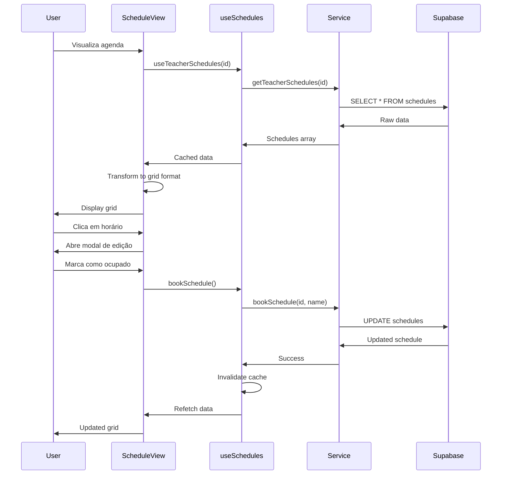

# Feature: Gestão de Agenda/Horários

## Status: ✅ Implementado

**Data de Implementação**: 2025-11-17
**Versão**: 1.0.0

## 📋 Visão Geral

Sistema completo para gerenciamento de horários de aulas com visualização em grade semanal, reservas, e status de disponibilidade.

## 🎯 Objetivos

- ✅ Visualizar agenda semanal em formato de grade
- ✅ Marcar horários como livre/ocupado/indisponível
- ✅ Reservar horário para aluno específico
- ✅ Liberar horário reservado
- ✅ Filtrar agenda por professor (admin) ou própria agenda (teacher)
- ✅ Identificar aulas do dia seguinte para lembretes
- ✅ Estados de loading e error handling
- ✅ Transformação de dados entre banco e UI

## 🏗️ Arquitetura

### Estrutura de Arquivos

```
src/
├── services/
│   └── schedule.service.ts      # Lógica de acesso a dados
├── hooks/
│   └── useSchedules.ts          # Hooks React Query
├── components/
│   ├── Dashboard/
│   │   └── ScheduleView.tsx     # Container da agenda
│   └── Schedule/
│       └── ScheduleGrid.tsx     # Grid visual da agenda
```

### Fluxo de Dados



## 💾 Estrutura de Dados

### Tabela: schedules

```sql
CREATE TABLE schedules (
  id UUID PRIMARY KEY DEFAULT uuid_generate_v4(),
  teacher_id UUID NOT NULL REFERENCES teachers(id) ON DELETE CASCADE,
  day_of_week INTEGER NOT NULL CHECK (day_of_week BETWEEN 0 AND 6),
  hour INTEGER NOT NULL CHECK (hour BETWEEN 0 AND 23),
  status TEXT NOT NULL DEFAULT 'livre'
    CHECK (status IN ('livre', 'com_aluno', 'indisponivel')),
  student_name TEXT,
  created_at TIMESTAMPTZ DEFAULT NOW(),
  updated_at TIMESTAMPTZ DEFAULT NOW(),

  -- Constraint única para evitar duplicação
  UNIQUE(teacher_id, day_of_week, hour)
);

-- Índices para performance
CREATE INDEX idx_schedules_teacher ON schedules(teacher_id);
CREATE INDEX idx_schedules_day_status ON schedules(day_of_week, status);
CREATE INDEX idx_schedules_teacher_day ON schedules(teacher_id, day_of_week);
```

### Type Definitions

```typescript
type Schedule = Database['public']['Tables']['schedules']['Row'];

interface Schedule {
  id: string;
  teacher_id: string;
  day_of_week: number;  // 0 = domingo, 1 = segunda, ..., 6 = sábado
  hour: number;         // 0-23
  status: 'livre' | 'com_aluno' | 'indisponivel';
  student_name: string | null;
  created_at: string;
  updated_at: string;
}

// Para UI
interface ScheduleSlot {
  id: string;
  time: string;         // "08:00"
  status: 'free' | 'occupied' | 'unavailable';
  studentName?: string;
  lastModified?: Date;
}
```

## 🔧 Implementação

### 1. Service Layer

**Arquivo**: `src/services/schedule.service.ts`

```typescript
import { supabase } from '@/integrations/supabase/client';
import { Database } from '@/integrations/supabase/types';

type Schedule = Database['public']['Tables']['schedules']['Row'];
type ScheduleInsert = Database['public']['Tables']['schedules']['Insert'];
type ScheduleUpdate = Database['public']['Tables']['schedules']['Update'];

/**
 * Buscar horários de um professor específico
 */
export async function getTeacherSchedules(
  teacherId: string
): Promise<Schedule[]> {
  const { data, error } = await supabase
    .from('schedules')
    .select('*')
    .eq('teacher_id', teacherId)
    .order('day_of_week', { ascending: true })
    .order('hour', { ascending: true });

  if (error) {
    throw new Error(`Erro ao buscar horários: ${error.message}`);
  }

  return data || [];
}

/**
 * Buscar todos os horários (admin)
 */
export async function getAllSchedules(): Promise<Schedule[]> {
  const { data, error } = await supabase
    .from('schedules')
    .select('*, teachers(name, email)')
    .order('day_of_week', { ascending: true })
    .order('hour', { ascending: true });

  if (error) {
    throw new Error(`Erro ao buscar horários: ${error.message}`);
  }

  return data || [];
}

/**
 * Reservar horário para um aluno
 */
export async function bookSchedule(
  id: string,
  studentName: string
): Promise<Schedule> {
  return updateSchedule(id, {
    status: 'com_aluno',
    student_name: studentName,
  });
}

/**
 * Liberar horário
 */
export async function freeSchedule(id: string): Promise<Schedule> {
  return updateSchedule(id, {
    status: 'livre',
    student_name: null,
  });
}

/**
 * Marcar horário como indisponível
 */
export async function markScheduleUnavailable(
  id: string
): Promise<Schedule> {
  return updateSchedule(id, {
    status: 'indisponivel',
    student_name: null,
  });
}

/**
 * Atualizar horário
 */
export async function updateSchedule(
  id: string,
  updates: ScheduleUpdate
): Promise<Schedule> {
  const { data, error } = await supabase
    .from('schedules')
    .update({
      ...updates,
      updated_at: new Date().toISOString(),
    })
    .eq('id', id)
    .select()
    .single();

  if (error) {
    throw new Error(`Erro ao atualizar horário: ${error.message}`);
  }

  return data;
}

/**
 * Criar novo horário
 */
export async function createSchedule(
  schedule: ScheduleInsert
): Promise<Schedule> {
  const { data, error } = await supabase
    .from('schedules')
    .insert(schedule)
    .select()
    .single();

  if (error) {
    throw new Error(`Erro ao criar horário: ${error.message}`);
  }

  return data;
}

/**
 * Deletar horário
 */
export async function deleteSchedule(id: string): Promise<void> {
  const { error } = await supabase
    .from('schedules')
    .delete()
    .eq('id', id);

  if (error) {
    throw new Error(`Erro ao deletar horário: ${error.message}`);
  }
}

/**
 * Buscar horários ocupados do dia seguinte (para lembretes)
 */
export async function getUpcomingSchedules(): Promise<Schedule[]> {
  const tomorrow = new Date();
  tomorrow.setDate(tomorrow.getDate() + 1);
  const dayOfWeek = tomorrow.getDay();

  const { data, error } = await supabase
    .from('schedules')
    .select('*, teachers(name, email)')
    .eq('day_of_week', dayOfWeek)
    .eq('status', 'com_aluno')
    .order('hour', { ascending: true });

  if (error) {
    throw new Error(`Erro ao buscar lembretes: ${error.message}`);
  }

  return data || [];
}

/**
 * Buscar horários livres de um professor
 */
export async function getAvailableSchedules(
  teacherId: string
): Promise<Schedule[]> {
  const { data, error } = await supabase
    .from('schedules')
    .select('*')
    .eq('teacher_id', teacherId)
    .eq('status', 'livre')
    .order('day_of_week', { ascending: true })
    .order('hour', { ascending: true });

  if (error) {
    throw new Error(`Erro ao buscar horários disponíveis: ${error.message}`);
  }

  return data || [];
}

/**
 * Buscar horários por dia da semana
 */
export async function getSchedulesByDay(
  teacherId: string,
  dayOfWeek: number
): Promise<Schedule[]> {
  const { data, error } = await supabase
    .from('schedules')
    .select('*')
    .eq('teacher_id', teacherId)
    .eq('day_of_week', dayOfWeek)
    .order('hour', { ascending: true });

  if (error) {
    throw new Error(`Erro ao buscar horários: ${error.message}`);
  }

  return data || [];
}
```

### 2. React Query Hooks

**Arquivo**: `src/hooks/useSchedules.ts` (250 linhas)

Hooks principais:
- `useTeacherSchedules(teacherId)` - Lista horários do professor
- `useAllSchedules()` - Lista todos (admin)
- `useBookSchedule()` - Reservar horário
- `useFreeSchedule()` - Liberar horário
- `useMarkScheduleUnavailable()` - Marcar indisponível
- `useUpcomingSchedules()` - Lembretes

### 3. UI Components

#### ScheduleView

**Arquivo**: `src/components/Dashboard/ScheduleView.tsx`

**Responsabilidades**:
- Fetch de dados com `useTeacherSchedules`
- Transformação de dados do banco para formato UI
- Gerenciamento de modal de edição
- Chamada de mutations

**Transformação de Dados**:

```typescript
// Mapeamento de day_of_week (0-6) para chave de dia
const dayOfWeekToKey = (dayOfWeek: number): string => {
  const days = ['sunday', 'monday', 'tuesday', 'wednesday', 'thursday', 'friday', 'saturday'];
  return days[dayOfWeek];
};

// Mapeamento de status
const mapStatus = (status: Schedule['status']): ScheduleSlot['status'] => {
  const statusMap = {
    'livre': 'free',
    'com_aluno': 'occupied',
    'indisponivel': 'unavailable',
  };
  return statusMap[status] || 'free';
};

// Transformação
const transformedSchedule = useMemo(() => {
  if (!schedules) return {};

  const schedule: Record<string, ScheduleSlot[]> = {
    monday: [], tuesday: [], wednesday: [], thursday: [], friday: [],
  };

  schedules.forEach((s) => {
    const dayKey = dayOfWeekToKey(s.day_of_week);
    if (!schedule[dayKey]) schedule[dayKey] = [];

    schedule[dayKey].push({
      id: s.id,
      time: `${s.hour.toString().padStart(2, '0')}:00`,
      status: mapStatus(s.status),
      studentName: s.student_name || undefined,
      lastModified: s.updated_at ? new Date(s.updated_at) : undefined,
    });
  });

  return schedule;
}, [schedules]);
```

#### ScheduleGrid

**Arquivo**: `src/components/Schedule/ScheduleGrid.tsx`

**Responsabilidades**:
- Renderização visual da grade
- Cores e badges de status
- Click handling
- Responsividade

## 📊 User Stories Relacionadas

- [US-SCHED-001: Visualizar Agenda Semanal](../../user-stories/schedules/US-SCHED-001.md)
- [US-SCHED-002: Reservar Horário](../../user-stories/schedules/US-SCHED-002.md)
- [US-SCHED-003: Liberar Horário](../../user-stories/schedules/US-SCHED-003.md)
- [US-SCHED-004: Marcar Indisponível](../../user-stories/schedules/US-SCHED-004.md)
- [US-SCHED-005: Ver Lembretes do Dia](../../user-stories/schedules/US-SCHED-005.md)

## 🧪 Testes

### Cenários de Teste

```typescript
describe('Schedule Management', () => {
  it('deve carregar horários do professor', async () => {
    // Test implementation
  });

  it('deve transformar dados corretamente', () => {
    // Test data transformation
  });

  it('deve reservar horário para aluno', async () => {
    // Test booking
  });

  it('deve liberar horário reservado', async () => {
    // Test freeing
  });

  it('deve marcar horário como indisponível', async () => {
    // Test unavailable
  });

  it('deve buscar lembretes do próximo dia', async () => {
    // Test reminders
  });
});
```

## 🐛 Problemas Conhecidos

Nenhum problema conhecido no momento.

## 🚀 Melhorias Futuras

- [ ] Drag & drop para reagendar
- [ ] Criação em massa de horários
- [ ] Recorrência de horários
- [ ] Conflito de horários (validação)
- [ ] Histórico de alterações
- [ ] Exportar agenda para PDF/iCal
- [ ] Sincronização com Google Calendar
- [ ] Notificações de mudanças na agenda

## 📝 Notas para Implementação

### Para LLMs: Como Adicionar Validação de Conflito

```typescript
export async function checkScheduleConflict(
  teacherId: string,
  dayOfWeek: number,
  hour: number
): Promise<boolean> {
  const { data, error } = await supabase
    .from('schedules')
    .select('id')
    .eq('teacher_id', teacherId)
    .eq('day_of_week', dayOfWeek)
    .eq('hour', hour)
    .limit(1);

  if (error) throw new Error(error.message);
  return (data?.length ?? 0) > 0;
}
```

### Para LLMs: Como Implementar Criação em Massa

```typescript
export async function createBulkSchedules(
  teacherId: string,
  days: number[],
  hours: number[]
): Promise<Schedule[]> {
  const schedules = days.flatMap(day =>
    hours.map(hour => ({
      teacher_id: teacherId,
      day_of_week: day,
      hour: hour,
      status: 'livre' as const,
    }))
  );

  const { data, error } = await supabase
    .from('schedules')
    .insert(schedules)
    .select();

  if (error) throw new Error(error.message);
  return data || [];
}
```

## 📚 Referências

- [Date Utilities](https://date-fns.org/)
- [React Query Mutations](https://tanstack.com/query/latest/docs/react/guides/mutations)

---

**Localização dos Arquivos**:
- Service: `src/services/schedule.service.ts` (220 linhas)
- Hooks: `src/hooks/useSchedules.ts` (250 linhas)
- View: `src/components/Dashboard/ScheduleView.tsx` (169 linhas)
- Grid: `src/components/Schedule/ScheduleGrid.tsx` (101 linhas)
