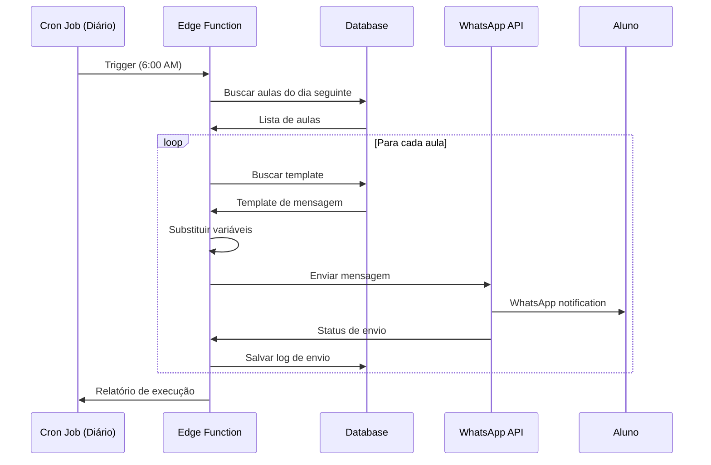

# Feature: WhatsApp Messaging

## Status: 📋 Planejado

**Prioridade**: Alta
**Estimativa**: 21 pontos de esforço
**Dependências**: Autenticação, Gestão de Agenda

## 📋 Visão Geral

Sistema completo de envio de mensagens via WhatsApp para alunos, incluindo lembretes automáticos, confirmações de aula e mensagens manuais.

## 🎯 Objetivos

- [ ] Enviar lembretes automáticos 24h antes da aula
- [ ] Enviar confirmações de agendamento
- [ ] Permitir envio manual de mensagens
- [ ] Usar templates de mensagem pré-aprovados
- [ ] Registrar histórico de mensagens enviadas
- [ ] Configurar horários de envio permitidos
- [ ] Integrar com WhatsApp Business API
- [ ] Dashboard de mensagens enviadas/falhas

## 🏗️ Arquitetura Proposta

### Fluxo de Mensagens Automáticas



### Estrutura de Arquivos Proposta

```
src/
├── services/
│   ├── whatsapp/
│   │   ├── client.ts                 # Cliente WhatsApp API
│   │   ├── message.service.ts        # Envio de mensagens
│   │   └── template.service.ts       # Gestão de templates
│   └── notification.service.ts       # Lógica de notificações
├── hooks/
│   ├── useWhatsAppMessages.ts        # Hooks React Query
│   └── useTemplates.ts               # Gestão de templates
└── components/
    └── WhatsApp/
        ├── MessageDashboard.tsx      # Dashboard de mensagens
        ├── TemplateManager.tsx       # Gestão de templates
        └── SendMessageDialog.tsx     # Envio manual

supabase/
└── functions/
    ├── send-daily-reminders/         # Edge Function
    │   └── index.ts
    └── send-message/                 # Edge Function
        └── index.ts
```

## 💾 Estrutura de Dados Proposta

### Novas Tabelas

#### whatsapp_messages

```sql
CREATE TABLE whatsapp_messages (
  id UUID PRIMARY KEY DEFAULT uuid_generate_v4(),
  schedule_id UUID REFERENCES schedules(id) ON DELETE SET NULL,
  phone_number TEXT NOT NULL,
  message_body TEXT NOT NULL,
  template_id UUID REFERENCES whatsapp_templates(id),
  status TEXT NOT NULL CHECK (status IN ('pending', 'sent', 'delivered', 'failed')),
  whatsapp_message_id TEXT,
  sent_at TIMESTAMPTZ,
  delivered_at TIMESTAMPTZ,
  error_message TEXT,
  created_at TIMESTAMPTZ DEFAULT NOW(),
  updated_at TIMESTAMPTZ DEFAULT NOW()
);

CREATE INDEX idx_whatsapp_messages_schedule ON whatsapp_messages(schedule_id);
CREATE INDEX idx_whatsapp_messages_status ON whatsapp_messages(status);
CREATE INDEX idx_whatsapp_messages_sent_at ON whatsapp_messages(sent_at);
```

#### whatsapp_templates

```sql
CREATE TABLE whatsapp_templates (
  id UUID PRIMARY KEY DEFAULT uuid_generate_v4(),
  name TEXT NOT NULL UNIQUE,
  template_body TEXT NOT NULL,
  variables JSONB NOT NULL DEFAULT '[]',
  is_active BOOLEAN DEFAULT TRUE,
  whatsapp_template_id TEXT,
  created_at TIMESTAMPTZ DEFAULT NOW(),
  updated_at TIMESTAMPTZ DEFAULT NOW()
);

-- Template exemplo
INSERT INTO whatsapp_templates (name, template_body, variables) VALUES
('reminder_24h',
 'Olá {{student_name}}! Lembrando que você tem aula amanhã às {{hour}}h com o professor {{teacher_name}}. Nos vemos lá! 📚',
 '["student_name", "hour", "teacher_name"]'
);
```

#### whatsapp_config

```sql
CREATE TABLE whatsapp_config (
  id UUID PRIMARY KEY DEFAULT uuid_generate_v4(),
  api_key TEXT NOT NULL,
  phone_number_id TEXT NOT NULL,
  business_account_id TEXT NOT NULL,
  webhook_verify_token TEXT NOT NULL,
  allowed_hours_start INTEGER DEFAULT 8 CHECK (allowed_hours_start BETWEEN 0 AND 23),
  allowed_hours_end INTEGER DEFAULT 20 CHECK (allowed_hours_end BETWEEN 0 AND 23),
  is_active BOOLEAN DEFAULT TRUE,
  created_at TIMESTAMPTZ DEFAULT NOW(),
  updated_at TIMESTAMPTZ DEFAULT NOW()
);
```

## 🔧 Implementação Proposta

### 1. WhatsApp Client

**Arquivo**: `src/services/whatsapp/client.ts`

```typescript
import { WhatsAppConfig } from '@/integrations/supabase/types';

export class WhatsAppClient {
  private apiKey: string;
  private phoneNumberId: string;
  private baseUrl = 'https://graph.facebook.com/v18.0';

  constructor(config: WhatsAppConfig) {
    this.apiKey = config.api_key;
    this.phoneNumberId = config.phone_number_id;
  }

  async sendMessage(to: string, body: string): Promise<string> {
    const response = await fetch(
      `${this.baseUrl}/${this.phoneNumberId}/messages`,
      {
        method: 'POST',
        headers: {
          'Authorization': `Bearer ${this.apiKey}`,
          'Content-Type': 'application/json',
        },
        body: JSON.stringify({
          messaging_product: 'whatsapp',
          to: to,
          type: 'text',
          text: { body },
        }),
      }
    );

    if (!response.ok) {
      const error = await response.json();
      throw new Error(`WhatsApp API error: ${error.error.message}`);
    }

    const data = await response.json();
    return data.messages[0].id;
  }

  async sendTemplate(
    to: string,
    templateName: string,
    variables: Record<string, string>
  ): Promise<string> {
    // Implementação de envio de template
    // Similar ao sendMessage mas usando templates
  }

  async getMessageStatus(messageId: string): Promise<string> {
    // Consultar status da mensagem
  }
}
```

### 2. Message Service

**Arquivo**: `src/services/whatsapp/message.service.ts`

```typescript
import { supabase } from '@/integrations/supabase/client';
import { WhatsAppClient } from './client';

export async function sendScheduleReminder(scheduleId: string): Promise<void> {
  // 1. Buscar dados da aula
  const { data: schedule } = await supabase
    .from('schedules')
    .select('*, teachers(name, email)')
    .eq('id', scheduleId)
    .single();

  if (!schedule || !schedule.student_name) {
    throw new Error('Aula não encontrada ou sem aluno');
  }

  // 2. Buscar template
  const { data: template } = await supabase
    .from('whatsapp_templates')
    .select('*')
    .eq('name', 'reminder_24h')
    .eq('is_active', true)
    .single();

  if (!template) {
    throw new Error('Template não encontrado');
  }

  // 3. Substituir variáveis
  let message = template.template_body;
  const variables = {
    student_name: schedule.student_name,
    hour: schedule.hour.toString(),
    teacher_name: schedule.teachers.name,
  };

  Object.entries(variables).forEach(([key, value]) => {
    message = message.replace(`{{${key}}}`, value);
  });

  // 4. Buscar config do WhatsApp
  const { data: config } = await supabase
    .from('whatsapp_config')
    .select('*')
    .eq('is_active', true)
    .single();

  if (!config) {
    throw new Error('WhatsApp não configurado');
  }

  // 5. Enviar mensagem
  const client = new WhatsAppClient(config);
  const phoneNumber = '+5511999999999'; // TODO: pegar do cadastro do aluno

  try {
    const whatsappMessageId = await client.sendMessage(phoneNumber, message);

    // 6. Registrar envio
    await supabase.from('whatsapp_messages').insert({
      schedule_id: scheduleId,
      phone_number: phoneNumber,
      message_body: message,
      template_id: template.id,
      status: 'sent',
      whatsapp_message_id: whatsappMessageId,
      sent_at: new Date().toISOString(),
    });
  } catch (error) {
    // Registrar falha
    await supabase.from('whatsapp_messages').insert({
      schedule_id: scheduleId,
      phone_number: phoneNumber,
      message_body: message,
      template_id: template.id,
      status: 'failed',
      error_message: error instanceof Error ? error.message : 'Unknown error',
    });
    throw error;
  }
}

export async function sendDailyReminders(): Promise<{
  sent: number;
  failed: number;
}> {
  // Buscar aulas do dia seguinte
  const tomorrow = new Date();
  tomorrow.setDate(tomorrow.getDate() + 1);
  const dayOfWeek = tomorrow.getDay();

  const { data: schedules } = await supabase
    .from('schedules')
    .select('*')
    .eq('day_of_week', dayOfWeek)
    .eq('status', 'com_aluno');

  let sent = 0;
  let failed = 0;

  for (const schedule of schedules || []) {
    try {
      await sendScheduleReminder(schedule.id);
      sent++;
    } catch (error) {
      console.error('Failed to send reminder:', error);
      failed++;
    }
  }

  return { sent, failed };
}
```

### 3. Edge Function para Lembretes

**Arquivo**: `supabase/functions/send-daily-reminders/index.ts`

```typescript
import { serve } from 'https://deno.land/std@0.168.0/http/server.ts';
import { createClient } from 'https://esm.sh/@supabase/supabase-js@2';

serve(async (req) => {
  try {
    const supabase = createClient(
      Deno.env.get('SUPABASE_URL') ?? '',
      Deno.env.get('SUPABASE_SERVICE_ROLE_KEY') ?? ''
    );

    // Buscar aulas do dia seguinte
    const tomorrow = new Date();
    tomorrow.setDate(tomorrow.getDate() + 1);
    const dayOfWeek = tomorrow.getDay();

    const { data: schedules } = await supabase
      .from('schedules')
      .select('*, teachers(name)')
      .eq('day_of_week', dayOfWeek)
      .eq('status', 'com_aluno');

    const results = {
      total: schedules?.length || 0,
      sent: 0,
      failed: 0,
      errors: [] as string[],
    };

    for (const schedule of schedules || []) {
      try {
        // Lógica de envio aqui
        results.sent++;
      } catch (error) {
        results.failed++;
        results.errors.push(error.message);
      }
    }

    return new Response(JSON.stringify(results), {
      headers: { 'Content-Type': 'application/json' },
    });
  } catch (error) {
    return new Response(JSON.stringify({ error: error.message }), {
      status: 500,
      headers: { 'Content-Type': 'application/json' },
    });
  }
});
```

### 4. Configurar Cron Job

**Arquivo**: `supabase/functions/.cron/send-daily-reminders.yaml`

```yaml
# Executar todos os dias às 6:00 AM
schedule: '0 6 * * *'
function: send-daily-reminders
```

## 📊 User Stories Relacionadas

- [US-WHATS-001: Configurar Integração WhatsApp](../../user-stories/whatsapp/US-WHATS-001.md)
- [US-WHATS-002: Criar Templates de Mensagem](../../user-stories/whatsapp/US-WHATS-002.md)
- [US-WHATS-003: Enviar Lembretes Automáticos](../../user-stories/whatsapp/US-WHATS-003.md)
- [US-WHATS-004: Enviar Mensagem Manual](../../user-stories/whatsapp/US-WHATS-004.md)
- [US-WHATS-005: Visualizar Histórico de Mensagens](../../user-stories/whatsapp/US-WHATS-005.md)

## 🧪 Testes Planejados

### Testes Unitários

```typescript
describe('WhatsApp Message Service', () => {
  it('deve substituir variáveis no template', () => {
    // Test template variable replacement
  });

  it('deve enviar mensagem via API', async () => {
    // Test API call
  });

  it('deve registrar mensagem enviada', async () => {
    // Test database logging
  });

  it('deve registrar falha de envio', async () => {
    // Test error logging
  });
});
```

### Testes de Integração

```typescript
describe('Daily Reminders', () => {
  it('deve buscar aulas do próximo dia', async () => {
    // Test schedule fetching
  });

  it('deve enviar lembretes para todas as aulas', async () => {
    // Test bulk sending
  });

  it('deve respeitar horário permitido', async () => {
    // Test time restrictions
  });
});
```

## 🔐 Segurança e Compliance

### Considerações de Segurança

1. **API Keys**: Armazenar em variáveis de ambiente
2. **Webhook Verification**: Validar tokens de webhook
3. **Rate Limiting**: Respeitar limites da WhatsApp API
4. **LGPD**: Obter consentimento para envio de mensagens
5. **Opt-out**: Permitir que alunos cancelem mensagens

### Compliance WhatsApp

1. Usar apenas templates aprovados pela Meta
2. Respeitar horários permitidos (8h-20h)
3. Não enviar mensagens promocionais
4. Permitir opt-out fácil

## 💰 Custos Estimados

### WhatsApp Business API

- **Setup**: Gratuito
- **Mensagens**:
  - Template messages: $0.005 - $0.01 por mensagem
  - Session messages (resposta): Grátis por 24h
- **Estimativa mensal** (100 alunos, 20 dias úteis):
  - 2,000 mensagens/mês
  - Custo: $10 - $20/mês

## 🚀 Alternativas Consideradas

1. **Chatwoot** (Open Source)
   - Pros: Grátis, self-hosted
   - Cons: Complexo de configurar

2. **Twilio** (API)
   - Pros: Fácil integração
   - Cons: Mais caro ($0.05/msg)

3. **WAHA** (Docker)
   - Pros: Grátis, usa WhatsApp Web
   - Cons: Menos confiável

4. **Evolution API** (Open Source) ✅ RECOMENDADO
   - Pros: Grátis, WhatsApp Web, API REST
   - Cons: Requer servidor próprio

**Decisão**: Evolution API para MVP, migrar para WhatsApp Business API em produção

## 📝 Passo a Passo de Implementação

### Fase 1: Setup Inicial (5 pontos)
- [ ] Criar tabelas no banco de dados
- [ ] Configurar Evolution API ou WhatsApp Business
- [ ] Criar variáveis de ambiente
- [ ] Implementar WhatsAppClient

### Fase 2: Templates (3 pontos)
- [ ] Criar interface de templates
- [ ] Implementar CRUD de templates
- [ ] Criar templates padrão
- [ ] Aprovar templates na Meta (se usar Business API)

### Fase 3: Envio Manual (5 pontos)
- [ ] Criar componente SendMessageDialog
- [ ] Implementar message.service
- [ ] Adicionar validação de phone
- [ ] Testar envio manual

### Fase 4: Lembretes Automáticos (8 pontos)
- [ ] Criar Edge Function
- [ ] Configurar Cron Job
- [ ] Implementar lógica de lembretes
- [ ] Adicionar logs e monitoring
- [ ] Testar execução automática

## 🐛 Riscos e Mitigações

| Risco | Probabilidade | Impacto | Mitigação |
|-------|--------------|---------|-----------|
| WhatsApp banir número | Média | Alto | Usar Business API oficial |
| Mensagens não chegarem | Baixa | Alto | Implementar retry + logs |
| Custos muito altos | Baixa | Médio | Monitorar uso, limitar envios |
| API fora do ar | Média | Médio | Fallback para SMS/Email |

## 📚 Recursos e Referências

- [WhatsApp Business API Docs](https://developers.facebook.com/docs/whatsapp)
- [Evolution API Docs](https://doc.evolution-api.com/)
- [Supabase Edge Functions](https://supabase.com/docs/guides/functions)
- [Supabase Cron Jobs](https://supabase.com/docs/guides/functions/schedule-functions)

## 📖 Documentação Adicional

- [Arquitetura Completa WhatsApp](../../whatsapp-messaging/01-ARQUITETURA.md)
- [Guia de Implementação](../../whatsapp-messaging/02-GUIA-IMPLEMENTACAO.md)
- [Comparação de Alternativas](../../whatsapp-messaging/05-ALTERNATIVAS.md)

---

**Estimativa Total**: 21 pontos de esforço
**Duração Estimada**: 2-3 sprints
**Prioridade**: Alta (após conclusão de features básicas)
